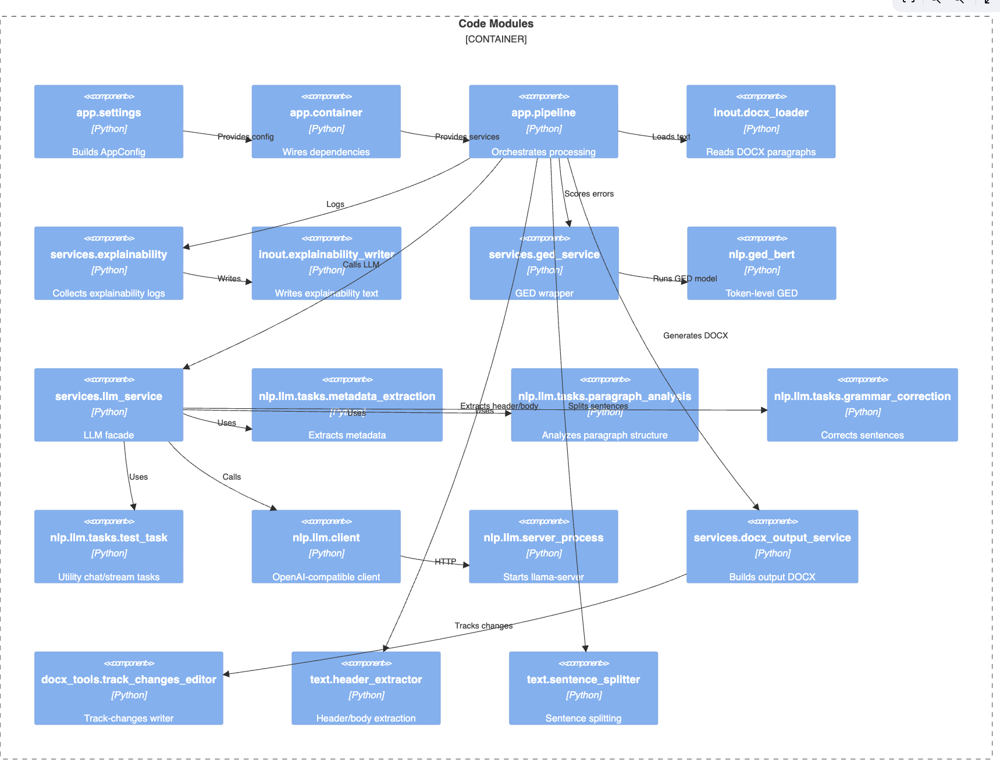

# Essay Feedback App

## Purpose
This app processes student essays, extracts metadata, runs GED (grammar error detection), applies selective LLM grammar corrections, and generates a tracked‑changes DOCX plus explainability reports.

## Development Setup

### 1) Clone the repo
```bash
git clone <YOUR_GITHUB_REPO_URL>
cd AgentFeedback
```

### 2) Create and activate a virtual environment
```bash
python3 -m venv venv
source venv/bin/activate
```

### 3) Install dependencies
```bash
pip install -r requirements.txt
```

### 4) Add llama.cpp (required for llama-server build)
The app expects the `llama.cpp` repo to be available as a subfolder of `third_party/` so it can build `llama-server` locally.

Create the folder and clone the repo:
```bash
mkdir -p third_party
git clone https://github.com/ggerganov/llama.cpp third_party/llama.cpp
```

Build `llama-server` (macOS/Linux):
```bash
cmake -S third_party/llama.cpp -B .appdata/build/llama.cpp -DCMAKE_BUILD_TYPE=Release -DBUILD_SHARED_LIBS=OFF
cmake --build .appdata/build/llama.cpp --config Release --target llama-server -j
```

On macOS, you may need Xcode Command Line Tools:
```bash
xcode-select --install
```

### 4) Download spaCy model (required for paragraph analysis)
```bash
python -m spacy download en_core_web_sm
```

### 5) Run the app
```bash
python3 provide_fb.py
```

Inputs are read from:
- `Assessment/in/*.docx`

Outputs are written to:
- `Assessment/checked/*.docx` (tracked‑changes output)
- `Assessment/explained/*.txt` (explainability logs)

## Configuration
Default config is in `app/settings.py` and includes:
- Input/output folder paths
- GED model
- LLM backend settings
- Run config (e.g., `max_llm_corrections`)

If the GGUF model or llama-server binary is missing, `bootstrap_llama` will download/build them into `.appdata/`.

## TODO (Packaging)
- Decide where spaCy `en_core_web_sm` should live inside the packaged app (resource path vs. app data).
- Decide how to bundle or fetch third‑party `llama.cpp` binaries for each OS.

## Architecture (4C in ASCII)

Code diagram (Mermaid): `architecture/04-code.md`



```
Context
+-------------------------+
| Essay Feedback App      |
| - GED + LLM + DOCX      |
+-----------+-------------+
            |
            | HTTP
            v
+-------------------------+
| llama-server (llama.cpp)|
+-------------------------+

Containers
+------------------------------+
| CLI Runner                   |
|  - build config              |
|  - build container           |
+---------------+--------------+
                |
                v
+------------------------------+
| Feedback Pipeline            |
|  - Docx Loader               |
|  - GED Service               |
|  - LLM Service               |
|  - DOCX Output Service       |
|  - Explainability Recorder   |
+---------------+--------------+
                |
                v
+------------------------------+
| Output Stores                |
|  - Assessment/checked/*.docx |
|  - Assessment/explained/*.txt|
+------------------------------+

Components
+------------------------------+
| app.pipeline                 |
|  - header/body extraction    |
|  - GED scoring               |
|  - LLM metadata extraction   |
|  - LLM grammar correction    |
|  - DOCX output + logging     |
+------------------------------+

Code (Key Modules)
+------------------------------+
| app.settings                 |
| app.container                |
| app.pipeline                 |
| services/llm_service.py      |
| services/ged_service.py      |
| services/docx_output_service |
| services/explainability.py   |
| nlp/llm/tasks/*              |
| nlp/ged_bert.py              |
| docx_tools/track_changes...  |
+------------------------------+
```
