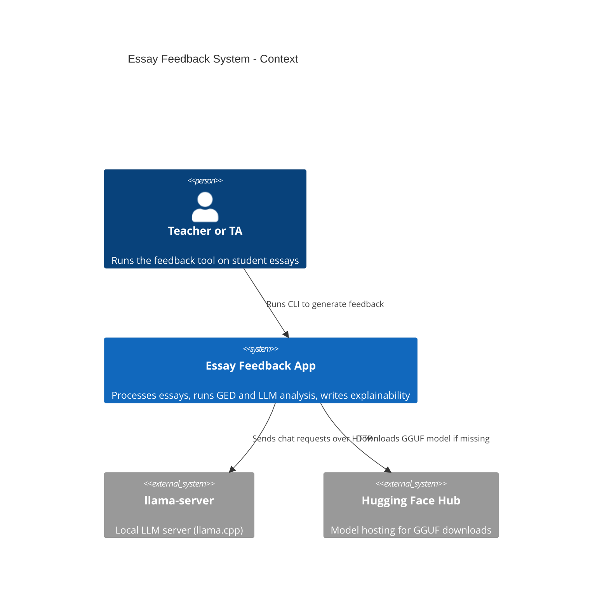

# C4 Context Diagram

```mermaid
C4Context
    title Essay Feedback System - Context

    Person(user, "Teacher or TA", "Runs the feedback tool on student essays")

    System(app, "Essay Feedback App", "Processes essays, runs GED and LLM analysis, writes explainability")

    System_Ext(llama, "llama-server", "Local LLM server (llama.cpp)")
    System_Ext(hf, "Hugging Face Hub", "Model hosting for GGUF downloads")

    Rel(user, app, "Runs CLI to generate feedback")
    Rel(app, llama, "Sends chat requests over HTTP")
    Rel(app, hf, "Downloads GGUF model if missing")
```
