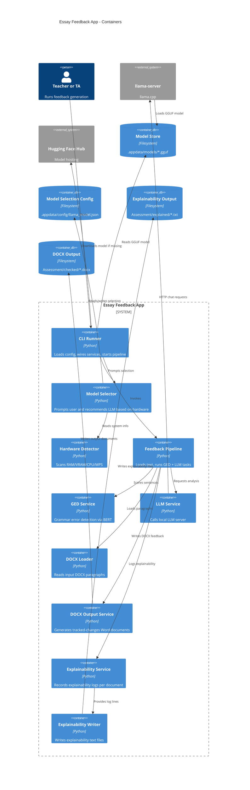

# C4 Container Diagram

```mermaid
C4Container
    title Essay Feedback App - Containers

    Person(user, "Teacher or TA", "Runs feedback generation")

    System_Boundary(app, "Essay Feedback App") {
        Container(cli, "CLI Runner", "Python", "Loads config, wires services, starts pipeline")
        Container(model_select, "Model Selector", "Python", "Prompts user and recommends LLM based on hardware")
        Container(hw_detect, "Hardware Detector", "Python", "Scans RAM/VRAM/CPU/MPS")
        Container(pipeline, "Feedback Pipeline", "Python", "Loads text, runs GED + LLM tasks")
        Container(ged, "GED Service", "Python", "Grammar error detection via BERT")
        Container(llm, "LLM Service", "Python", "Calls local LLM server")
        Container(docx, "DOCX Loader", "Python", "Reads input DOCX paragraphs")
        Container(docx_out, "DOCX Output Service", "Python", "Generates tracked-changes Word documents")
        Container(explain, "Explainability Service", "Python", "Records explainability logs per document")
        Container(explain_writer, "Explainability Writer", "Python", "Writes explainability text files")
    }

    System_Ext(llama, "llama-server", "llama.cpp", "Local LLM inference server")
    System_Ext(hf, "Hugging Face Hub", "Model hosting", "Downloads GGUF model")
    ContainerDb(models, "Model Store", "Filesystem", ".appdata/models/*.gguf")
    ContainerDb(model_cfg, "Model Selection Config", "Filesystem", ".appdata/config/llama_model.json")
    ContainerDb(explained, "Explainability Output", "Filesystem", "Assessment/explained/*.txt")
    ContainerDb(docx_out_files, "DOCX Output", "Filesystem", "Assessment/checked/*.docx")

    Rel(user, cli, "Runs")
    Rel(cli, model_select, "Prompts selection")
    Rel(model_select, hw_detect, "Reads system info")
    Rel(model_select, model_cfg, "Reads/writes selection")
    Rel(cli, pipeline, "Invokes")
    Rel(pipeline, docx, "Loads paragraphs")
    Rel(pipeline, ged, "Scores sentences")
    Rel(pipeline, llm, "Requests analysis")
    Rel(pipeline, docx_out, "Writes DOCX feedback")
    Rel(pipeline, explain, "Logs explainability")
    Rel(explain, explain_writer, "Provides log lines")
    Rel(explain_writer, explained, "Writes explainability files")
    Rel(docx_out, docx_out_files, "Writes output documents")
    Rel(llm, llama, "HTTP chat requests")
    Rel(cli, hf, "Downloads model if missing")
    Rel(cli, models, "Reads GGUF model")
    Rel(llama, models, "Loads GGUF model")
```
