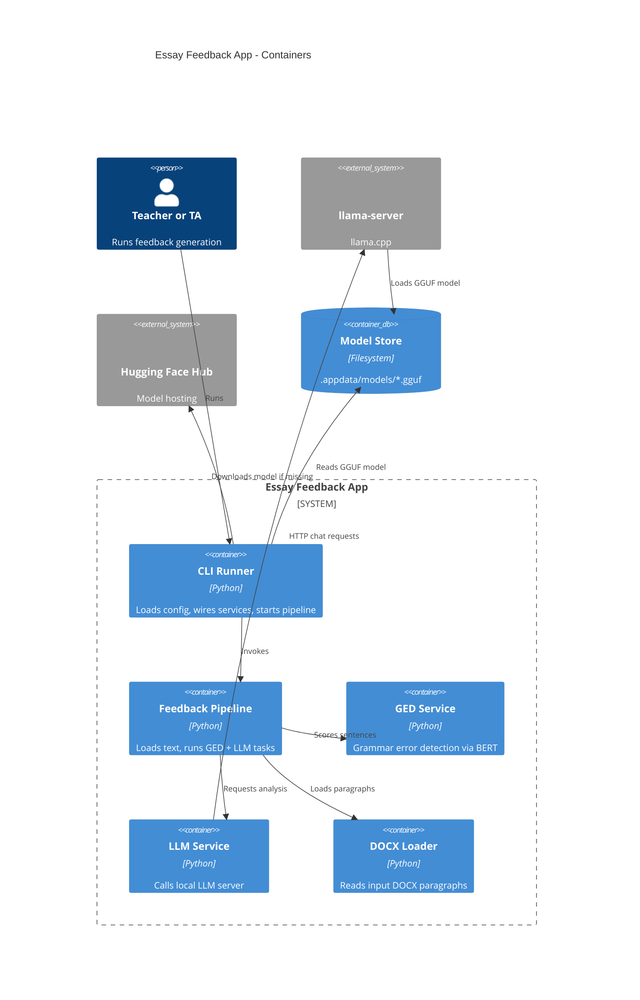

# C4 Container Diagram

```mermaid
C4Container
    title Essay Feedback App - Containers

    Person(user, "Teacher or TA", "Runs feedback generation")

    System_Boundary(app, "Essay Feedback App") {
        Container(cli, "CLI Runner", "Python", "Loads config, wires services, starts pipeline")
        Container(pipeline, "Feedback Pipeline", "Python", "Loads text, runs GED + LLM tasks")
        Container(ged, "GED Service", "Python", "Grammar error detection via BERT")
        Container(llm, "LLM Service", "Python", "Calls local LLM server")
        Container(docx, "DOCX Loader", "Python", "Reads input DOCX paragraphs")
    }

    System_Ext(llama, "llama-server", "llama.cpp", "Local LLM inference server")
    System_Ext(hf, "Hugging Face Hub", "Model hosting", "Downloads GGUF model")
    ContainerDb(models, "Model Store", "Filesystem", ".appdata/models/*.gguf")

    Rel(user, cli, "Runs")
    Rel(cli, pipeline, "Invokes")
    Rel(pipeline, docx, "Loads paragraphs")
    Rel(pipeline, ged, "Scores sentences")
    Rel(pipeline, llm, "Requests analysis")
    Rel(llm, llama, "HTTP chat requests")
    Rel(cli, hf, "Downloads model if missing")
    Rel(cli, models, "Reads GGUF model")
    Rel(llama, models, "Loads GGUF model")
```
