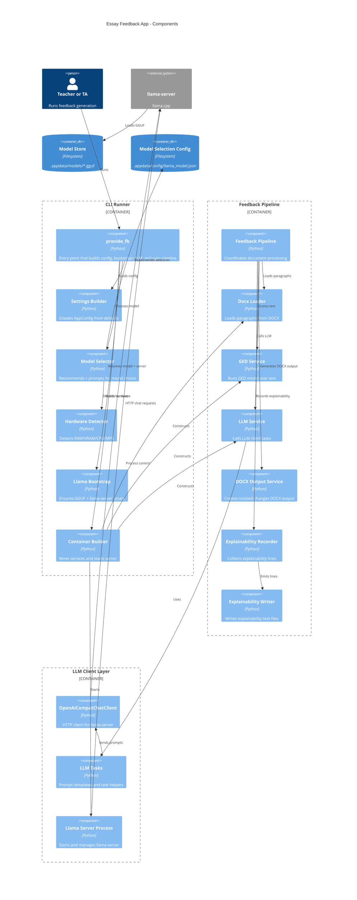

# C4 Component Diagram

```mermaid
C4Component
    title Essay Feedback App - Components

    Person(user, "Teacher or TA", "Runs feedback generation")

    Container_Boundary(cli, "CLI Runner") {
        Component(provide, "provide_fb", "Python", "Entry point that builds config, bootstraps LLM, and runs pipeline")
        Component(settings, "Settings Builder", "Python", "Creates AppConfig from defaults")
        Component(model_select, "Model Selector", "Python", "Recommends + prompts for model choice")
        Component(hw_detect, "Hardware Detector", "Python", "Detects RAM/VRAM/CPU/MPS")
        Component(bootstrap, "Llama Bootstrap", "Python", "Ensures GGUF + llama-server binary")
        Component(container, "Container Builder", "Python", "Wires services and starts server")
    }

    Container_Boundary(pipeline, "Feedback Pipeline") {
        Component(pipeline_core, "Feedback Pipeline", "Python", "Coordinates document processing")
        Component(docx, "Docx Loader", "Python", "Loads paragraphs from DOCX")
        Component(ged, "GED Service", "Python", "Runs GED model over text")
        Component(llm, "LLM Service", "Python", "Calls LLM client tasks")
        Component(docx_out, "DOCX Output Service", "Python", "Creates tracked-changes DOCX output")
        Component(explain, "Explainability Recorder", "Python", "Collects explainability lines")
        Component(explain_writer, "Explainability Writer", "Python", "Writes explainability text files")
    }

    Container_Boundary(llm_layer, "LLM Client Layer") {
        Component(client, "OpenAICompatChatClient", "Python", "HTTP client for llama-server")
        Component(tasks, "LLM Tasks", "Python", "Prompt templates and task helpers")
        Component(server, "Llama Server Process", "Python", "Starts and manages llama-server")
    }

    System_Ext(llama, "llama-server", "llama.cpp", "Local inference server")
    ContainerDb(models, "Model Store", "Filesystem", ".appdata/models/*.gguf")
    ContainerDb(model_cfg, "Model Selection Config", "Filesystem", ".appdata/config/llama_model.json")

    Rel(user, provide, "Runs")
    Rel(provide, settings, "Builds config")
    Rel(provide, model_select, "Chooses model")
    Rel(model_select, hw_detect, "Detects hardware")
    Rel(model_select, model_cfg, "Reads/writes selection")
    Rel(provide, bootstrap, "Resolves model + server")
    Rel(provide, container, "Builds services")

    Rel(container, server, "Starts")
    Rel(container, docx, "Constructs")
    Rel(container, ged, "Constructs")
    Rel(container, llm, "Constructs")

    Rel(pipeline_core, docx, "Loads paragraphs")
    Rel(pipeline_core, ged, "Scores text")
    Rel(pipeline_core, llm, "Calls LLM")
    Rel(pipeline_core, docx_out, "Generates DOCX output")
    Rel(pipeline_core, explain, "Records explainability")
    Rel(explain, explain_writer, "Emits lines")

    Rel(llm, tasks, "Uses")
    Rel(tasks, client, "Sends prompts")
    Rel(client, llama, "HTTP chat requests")
    Rel(server, llama, "Process control")
    Rel(llama, models, "Loads GGUF")
```
