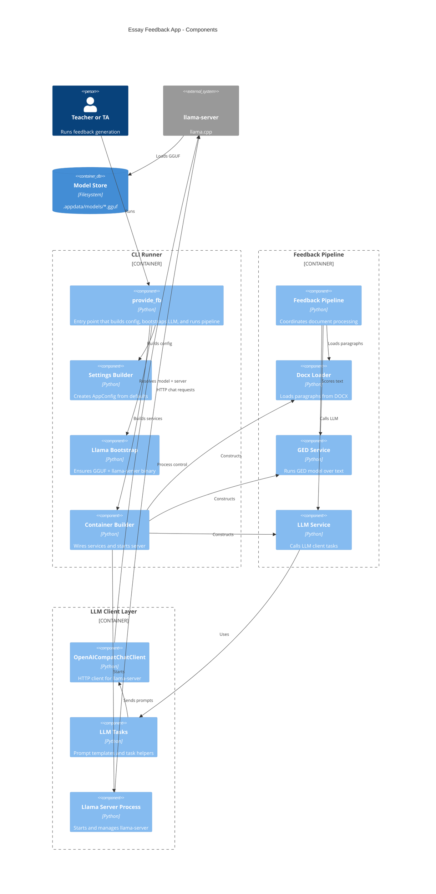

# C4 Component Diagram

```mermaid
C4Component
    title Essay Feedback App - Components

    Person(user, "Teacher or TA", "Runs feedback generation")

    Container_Boundary(cli, "CLI Runner") {
        Component(provide, "provide_fb", "Python", "Entry point that builds config, bootstraps LLM, and runs pipeline")
        Component(settings, "Settings Builder", "Python", "Creates AppConfig from defaults")
        Component(bootstrap, "Llama Bootstrap", "Python", "Ensures GGUF + llama-server binary")
        Component(container, "Container Builder", "Python", "Wires services and starts server")
    }

    Container_Boundary(pipeline, "Feedback Pipeline") {
        Component(pipeline_core, "Feedback Pipeline", "Python", "Coordinates document processing")
        Component(docx, "Docx Loader", "Python", "Loads paragraphs from DOCX")
        Component(ged, "GED Service", "Python", "Runs GED model over text")
        Component(llm, "LLM Service", "Python", "Calls LLM client tasks")
    }

    Container_Boundary(llm_layer, "LLM Client Layer") {
        Component(client, "OpenAICompatChatClient", "Python", "HTTP client for llama-server")
        Component(tasks, "LLM Tasks", "Python", "Prompt templates and task helpers")
        Component(server, "Llama Server Process", "Python", "Starts and manages llama-server")
    }

    System_Ext(llama, "llama-server", "llama.cpp", "Local inference server")
    ContainerDb(models, "Model Store", "Filesystem", ".appdata/models/*.gguf")

    Rel(user, provide, "Runs")
    Rel(provide, settings, "Builds config")
    Rel(provide, bootstrap, "Resolves model + server")
    Rel(provide, container, "Builds services")

    Rel(container, server, "Starts")
    Rel(container, docx, "Constructs")
    Rel(container, ged, "Constructs")
    Rel(container, llm, "Constructs")

    Rel(pipeline_core, docx, "Loads paragraphs")
    Rel(pipeline_core, ged, "Scores text")
    Rel(pipeline_core, llm, "Calls LLM")

    Rel(llm, tasks, "Uses")
    Rel(tasks, client, "Sends prompts")
    Rel(client, llama, "HTTP chat requests")
    Rel(server, llama, "Process control")
    Rel(llama, models, "Loads GGUF")
```
