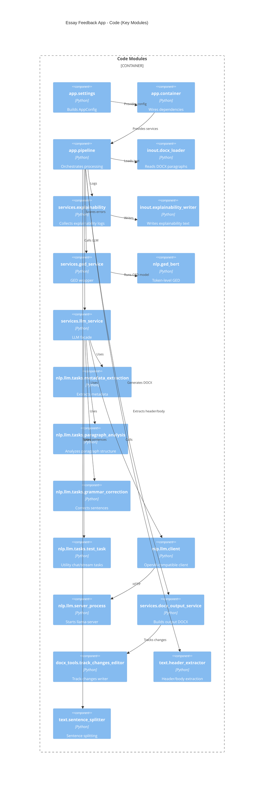

# C4 Code Diagram

```mermaid
C4Component
    title Essay Feedback App - Code (Key Modules)

    Container_Boundary(code, "Code Modules") {
        Component(settings, "app.settings", "Python", "Builds AppConfig")
        Component(container, "app.container", "Python", "Wires dependencies")
        Component(pipeline, "app.pipeline", "Python", "Orchestrates processing")

        Component(docx_loader, "inout.docx_loader", "Python", "Reads DOCX paragraphs")
        Component(explain_rec, "services.explainability", "Python", "Collects explainability logs")
        Component(explain_writer, "inout.explainability_writer", "Python", "Writes explainability text")

        Component(ged_service, "services.ged_service", "Python", "GED wrapper")
        Component(ged_model, "nlp.ged_bert", "Python", "Token-level GED")

        Component(llm_service, "services.llm_service", "Python", "LLM facade")
        Component(meta_task, "nlp.llm.tasks.metadata_extraction", "Python", "Extracts metadata")
        Component(paragraph_task, "nlp.llm.tasks.paragraph_analysis", "Python", "Analyzes paragraph structure")
        Component(grammar_task, "nlp.llm.tasks.grammar_correction", "Python", "Corrects sentences")
        Component(test_task, "nlp.llm.tasks.test_task", "Python", "Utility chat/stream tasks")
        Component(llm_client, "nlp.llm.client", "Python", "OpenAI-compatible client")
        Component(llm_server, "nlp.llm.server_process", "Python", "Starts llama-server")

        Component(docx_out, "services.docx_output_service", "Python", "Builds output DOCX")
        Component(track_changes, "docx_tools.track_changes_editor", "Python", "Track-changes writer")

        Component(text_header, "text.header_extractor", "Python", "Header/body extraction")
        Component(text_split, "text.sentence_splitter", "Python", "Sentence splitting")
    }

    Rel(settings, container, "Provides config")
    Rel(container, pipeline, "Provides services")

    Rel(pipeline, docx_loader, "Loads text")
    Rel(pipeline, ged_service, "Scores errors")
    Rel(ged_service, ged_model, "Runs GED model")

    Rel(pipeline, llm_service, "Calls LLM")
    Rel(llm_service, meta_task, "Uses")
    Rel(llm_service, paragraph_task, "Uses")
    Rel(llm_service, grammar_task, "Uses")
    Rel(llm_service, test_task, "Uses")
    Rel(llm_service, llm_client, "Calls")
    Rel(llm_client, llm_server, "HTTP")

    Rel(pipeline, explain_rec, "Logs")
    Rel(explain_rec, explain_writer, "Writes")

    Rel(pipeline, docx_out, "Generates DOCX")
    Rel(docx_out, track_changes, "Tracks changes")

    Rel(pipeline, text_header, "Extracts header/body")
    Rel(pipeline, text_split, "Splits sentences")
```
